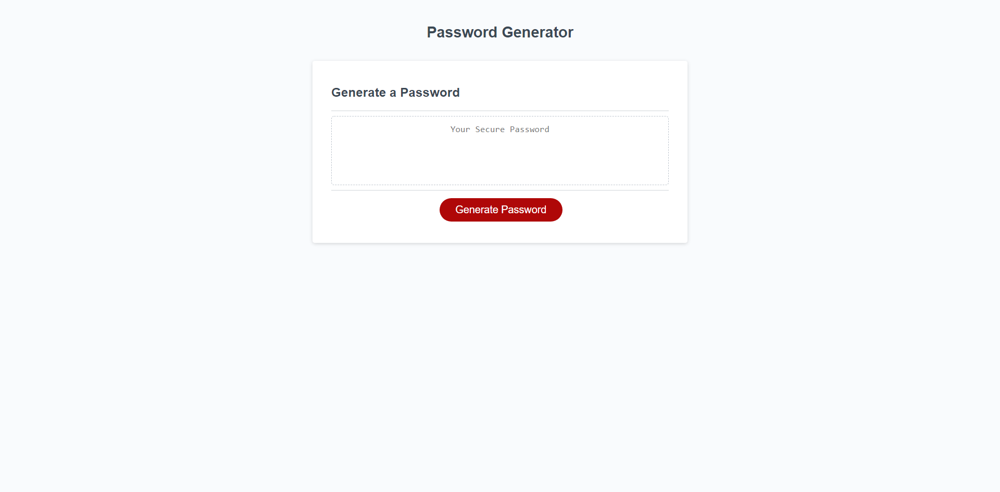

# password-generator
A simple password generator which uses modal windows to solicit the user's parameters for the password, and generates a random password based upon the user selections.

## Description
This application generates a password of a user defined length (between 8-128 characters) and selected character types (uppercase, lowercase, numeric and special). The password is generated via JavaScript code.  The script is accessed via html with a button to initiate password generation and prompts and confirms to select password parameters.   After selection, the generated password is displayed in the browser window.

## Installation
Upload index.html, script.js, styles.css and license.txt to the deployed webserver.  

The application shown below was deployed using GitHub Pages.  The repository can be replicated by via fork, clone, and redeployment with GitHub Pages.

Link to repository: [https://github.com/pkriengsiri/password-generator](https://github.com/pkriengsiri/password-generator)

## Usage
Link to deployed instance of the application: [https://pkriengsiri.github.io/password-generator/](https://pkriengsiri.github.io/password-generator/)

## Credits
Collaborators on this project included instructional staff, TAs, and students in the Georgia Tech Coding Boot Camp Winter 2020 cohort.

## License

MIT License

Copyright (c) [2020] [Pete Kriengsiri]

Permission is hereby granted, free of charge, to any person obtaining a copy
of this software and associated documentation files (the "Software"), to deal
in the Software without restriction, including without limitation the rights
to use, copy, modify, merge, publish, distribute, sublicense, and/or sell
copies of the Software, and to permit persons to whom the Software is
furnished to do so, subject to the following conditions:

The above copyright notice and this permission notice shall be included in all
copies or substantial portions of the Software.

THE SOFTWARE IS PROVIDED "AS IS", WITHOUT WARRANTY OF ANY KIND, EXPRESS OR
IMPLIED, INCLUDING BUT NOT LIMITED TO THE WARRANTIES OF MERCHANTABILITY,
FITNESS FOR A PARTICULAR PURPOSE AND NONINFRINGEMENT. IN NO EVENT SHALL THE
AUTHORS OR COPYRIGHT HOLDERS BE LIABLE FOR ANY CLAIM, DAMAGES OR OTHER
LIABILITY, WHETHER IN AN ACTION OF CONTRACT, TORT OR OTHERWISE, ARISING FROM,
OUT OF OR IN CONNECTION WITH THE SOFTWARE OR THE USE OR OTHER DEALINGS IN THE
SOFTWARE.

## Badges

## Contributing

This project is not accepting contributions at this time.